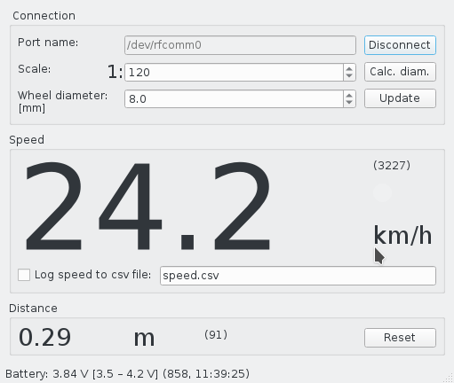

# WSM Speed Reader



WSM Speed Reader is a simple desktop application. It connects to the serial
port of the *Wireless SpeedoMeter* and displays its speed.

This application is developed in [QT](https://www.qt.io/).

## Resources

 * [WSM PCB](https://github.com/kmzbrnoI/wsm-pcb)
 * [WSM FW](https://github.com/kmzbrnoI/wsm-fw)

## Building & toolkit

This SW was developed in `vim` using `make`. Downloads are available in
*Releases* section. It is suggested to use `clang` as a compiler, because
then you may use `clang-tools` during development process (see below).

### Prerequisities

 * Qt 5
 * Qt's `serialport`
 * Optional: clang build tools (see below)
 * Optional for clang: [Bear](https://github.com/rizsotto/Bear)

### Build

Clone this repository (including submodules!):

```
git clone --recurse-submodules https://github.com/kmzbrnoI/wsm-speed-reader
```

And then build:

```
$ mkdir build
$ cd build
$ qmake -spec linux-clang ..
$ bear make
```

## Connecting to WSM

 * Windows: pair it with HC-05 module, serial port should be added
   automatically
 * Linux: pair it with HC-05 module and map it to new serial device:

    ```
    rfcomm connect /dev/rfcomm0 hc-05-hw-address 2
    ```

## Style checking

```
$ clang-tidy-7 -p build -extra-arg-before=-x -extra-arg-before=c++ -extra-arg=-std=c++14 -header-filter=. src/*.cpp
$ clang-format-7 *.cpp *.h
```

## Authors

 * Jan Horacek ([jan.horacek@kmz-brno.cz](mailto:jan.horacek@kmz-brno.cz))

## License

This application is released under the [Apache License v2.0
](https://www.apache.org/licenses/LICENSE-2.0).
